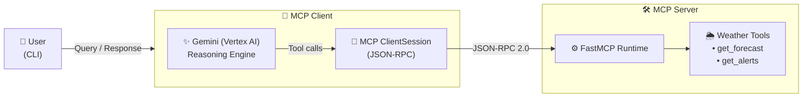
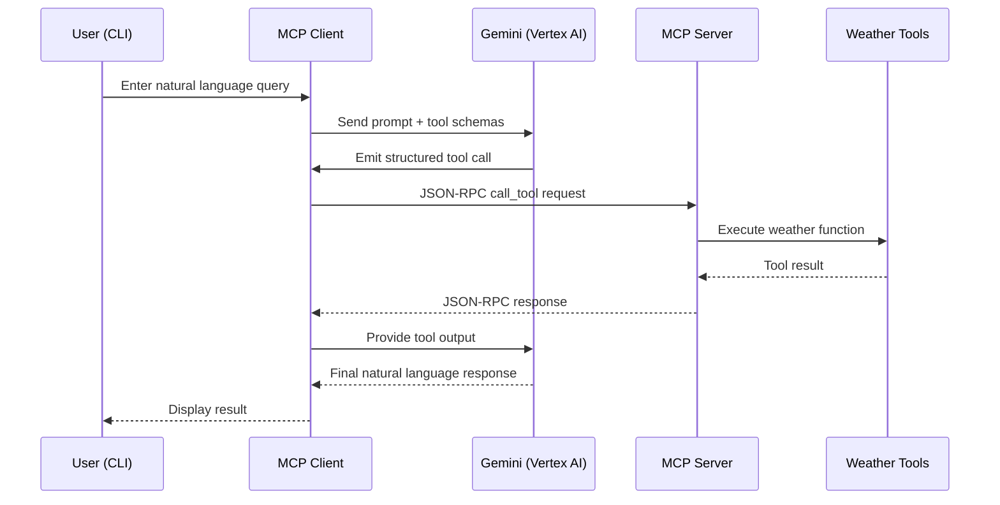

# Build Your Own MCP Server & Client (STDIO + Gemini)

This repository demonstrates how to **build a complete Model Context Protocol (MCP) system from scratch**, including:

- An **MCP server** exposing tools using FastMCP
- An **MCP client** that launches the server and communicates via **JSON-RPC 2.0 over STDIO**
- Integration with **Vertex AI Gemini** for reasoning and tool orchestration
- A correct **multi-step tool chaining loop** (not limited to single-round tool calls)

This project is **production-aligned, and fully runnable locally**.

---
## 🏗️ Architecture Diagram

**Important distinction**

- Terminal I/O → **human interaction**
- STDIO transport → **machine-to-machine JSON-RPC communication**
  

---
## 🏗️ Execution Sequence (End-to-End)


**Key Notes**
- STDIO is used only for **client ↔ server JSON-RPC**
- Terminal I/O is strictly **human interaction**
- Gemini never calls tools directly — it **requests**, the client executes
- Tool chaining is handled by a **while-loop on the client**

---

## 📁 Project Structure
```text
Build-Your-Own-Mcp-Server-Client/
├── weather/
│   ├── weather.py        # MCP server: FastMCP runtime + weather tools
│   ├── client.py         # MCP client: Gemini reasoning + tool loop
│   ├── pyproject.toml    # uv project configuration & dependencies
│   ├── uv.lock           # Locked, reproducible dependency versions
│   ├── .gitignore        # Ignores .env, .venv, caches, OS artifacts
│   └── README.md         # Weather MCP module documentation
└── README.md             # Root project overview & architecture
```
---

## 🚀 Features

- ✅ MCP server built using **FastMCP**
- ✅ **STDIO-based** JSON-RPC communication
- ✅ Tool discovery (`list_tools`)
- ✅ Tool execution (`call_tool`)
- ✅ **Multi-round tool chaining** using a proper loop
- ✅ **Vertex AI Gemini** integration (IAM-based auth)
- ✅ Async-safe lifecycle management with `AsyncExitStack`
- ✅ Clean dependency management using **uv**

---

## 🛠️ Prerequisites

- Python **3.10+**
- [`uv`](https://github.com/astral-sh/uv) package manager
- Google Cloud project with:
  - Vertex AI enabled
  - Gemini model access
- Authenticated locally using:
  ```bash
  gcloud auth application-default login
  ```
---
## ⚙️ Setup Instructions

Follow these steps to run the MCP server and client locally.

---

### 1️⃣ Clone the repository

```bash
git clone https://github.com/AvinashBolleddula/Build-Your-Own-Mcp-Server-Client.git
cd Build-Your-Own-Mcp-Server-Client/weather
```

### 2️⃣ Create and activate a virtual environment
This project uses uv for fast and reproducible Python environments.
```bash
uv venv
source .venv/bin/activate
```
You should now see (.venv) in your terminal prompt.

### 3️⃣ Install dependencies
Install all required dependencies exactly as defined in pyproject.toml and uv.lock.
```bash
uv sync
```
### 4️⃣ Configure environment variables
Create a .env file inside the weather/ directory:
```bash
GOOGLE_CLOUD_PROJECT=your-gcp-project-id
GOOGLE_CLOUD_LOCATION=us-central1
GEMINI_MODEL=gemini-2.0-flash
```
Note
Vertex AI uses IAM authentication, not API keys
Ensure you are authenticated locally using:
```bash
gcloud auth application-default login
```
### 5️⃣ Run the MCP client and server
From inside the weather/ directory:
```bash
python client.py weather.py
```
If everything is configured correctly, you should see:
```bash
Connected to server with tools: ['get_alerts', 'get_forecast']
MCP Client Started!
```
You can now start interacting with the system via the terminal.
